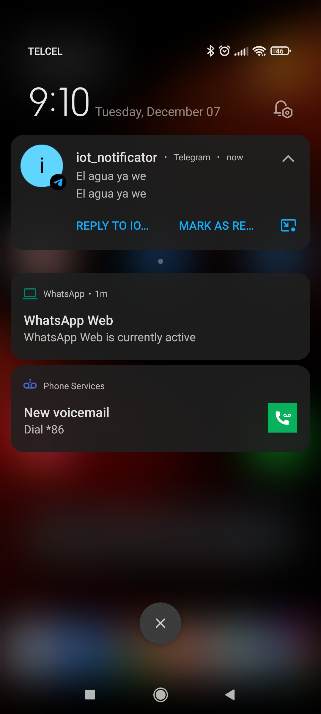

# Proyecto IOT
### Descripción del proyecto

Este proyecto consiste en un sensor ultrásonico que realiza mediciones de distacia y envia notificaciones a través de Telegram.

### Requerimientos
* NodeJS version 12 o superior
* Micropython
* Algún IDE que permite cargar código a la NodeMCU
* NodeMCU ESP32
* Sensor últrásonico HC-SR04

### Intalación Servidor
Lo primero es correr el servidor que será el encargado de recibir la petición y enviar la notificación a Telegram.

Se necesitas una serie de variables de entorno. Se debe crear un directorio llamado `env` dentro de la carpeta `pre-start` y poner las siguinetes variable:

```
## Environment ##
NODE_ENV=development
TOKEN_TELEGRAM=<token>
CHAT_ID=<chat id>

## Server ##
PORT=3000
HOST=localhost

## Setup jet-logger ##
JET_LOGGER_MODE=CONSOLE
JET_LOGGER_FILEPATH=jet-logger.log
JET_LOGGER_TIMESTAMP=TRUE
JET_LOGGER_FORMAT=LINE

```

* Este [enlace](https://tecnonucleous.com/2020/02/13/como-generar-el-token-de-nuestro-bot-con-botfather/) contiene una guía sobre como obtener el token de telegram

* Este otro [enlace](https://www.it-swarm-es.com/es/telegram/telegram-bot-como-obtener-una-identificacion-de-chat-de-grupo/1055556241/#:~:text=Vaya%20al%20grupo%2C%20haga%20clic,un%20mensaje%20ficticio%20al%20bot.&text=4%2D%20Busque%20%22chat%22%3A,(con%20el%20signo%20negativo).) muestra como obtener el `chat id` una vez que se tenga el token

Para primer instalción asegurese de correr el comando: `npm install` para instalar todas las dependecias necesarias.

Para correr la aplicación correr:   

`npm run start:dev`

### Instalación del sensor

El archivo de python se encuntra en la siguiente ruta:

```
project
└───src
|   └───scripts
|       └───main.py
```
* Básicamente sólo cargue el archivo a su NodeMCU

Para más referencias sobre conexiones del sensor etc. Consulte el siguiente [enlace](https://randomnerdtutorials.com/micropython-hc-sr04-ultrasonic-esp32-esp8266/)

### Resultados

#### Sensor 




El video lo puede ver [aquí](https://youtu.be/7-4bvA9pIbk)


